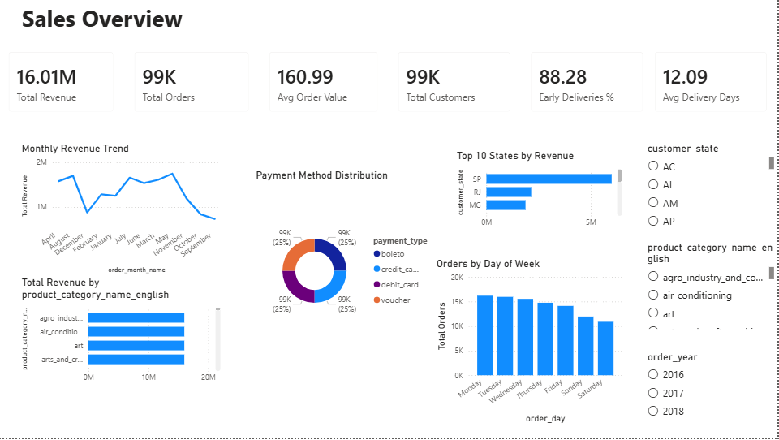
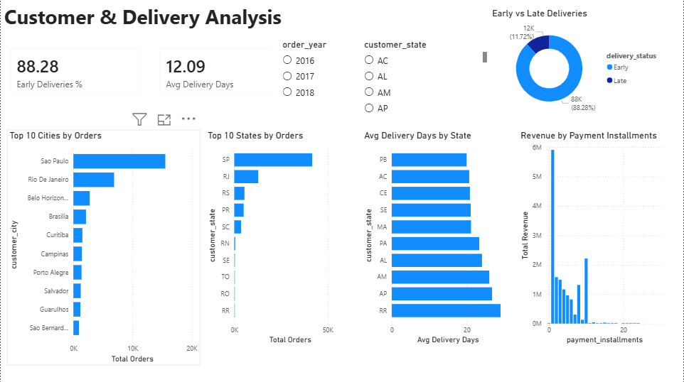

# 🛒 E-Commerce Sales Analytics Dashboard

An interactive Power BI dashboard analyzing 99,441 orders from a Brazilian e-commerce platform (Olist) across 6 related tables using Python, MySQL, and Power BI.

---

## 📸 Screenshots

### Page 1 — Sales Overview


### Page 2 — Customer & Delivery Analysis


---

## 📊 Dashboard Pages

### Page 1 — Sales Overview
- Total Revenue, Total Orders, Avg Order Value, Total Customers, Early Deliveries %, Avg Delivery Days — KPI Cards
- Monthly Revenue Trend — Line Chart
- Top 10 Product Categories by Revenue — Bar Chart
- Payment Method Distribution — Donut Chart
- Orders by Day of Week — Column Chart
- Top 10 States by Revenue — Bar Chart
- Dynamic Slicers — Year, State, Category

### Page 2 — Customer & Delivery Analysis
- Early vs Late Deliveries — Donut Chart
- Top 10 Cities by Orders — Bar Chart
- Top 10 States by Orders — Bar Chart
- Avg Delivery Days by State — Bar Chart
- Revenue by Payment Installments — Column Chart
- Dynamic Slicers — Year, State

---

## 🔍 Key Insights

- Total Revenue of **16.01M** across 99,441 orders
- **88.28%** of orders delivered before estimated delivery date
- **Sao Paulo** is the top city with highest order volume
- **SP state** generates highest revenue among all Brazilian states
- Average delivery time is **12.09 days**
- **Credit card** is the most used payment method
- **Monday** has the highest order volume across all days
- Single installment payments generate the most revenue

---

## 🛠️ Tools Used

- **Python** — Data cleaning and MySQL import (pandas, mysql-connector)
- **MySQL** — Database with 6 tables and 5 relationships
- **Power BI Desktop** — Interactive dashboard and visualization
- **SQL** — 14 analytical queries for business insights

---

## 🗄️ Database Schema
orders (99,441 rows)
├── order_items (112,650 rows)
│       ├── products (32,951 rows)
│       └── sellers (3,095 rows)
├── payments (103,877 rows)
└── customers (99,441 rows)

### Relationships
orders[order_id]        → order_items[order_id]     (One to Many)
orders[order_id]        → payments[order_id]         (One to Many)
orders[customer_id]     → customers[customer_id]     (Many to One)
order_items[product_id] → products[product_id]       (Many to One)
order_items[seller_id]  → sellers[seller_id]         (Many to One)

---

## 📁 Dataset

- **Source:** Kaggle — Brazilian E-Commerce Public Dataset by Olist
- **Date Range:** 2016 — 2018
- **Orders:** 99,441
- **Order Items:** 112,650
- **Payments:** 103,877
- **Customers:** 99,441
- **Products:** 32,951
- **Sellers:** 3,095

---

## ⚙️ How to Run

### Prerequisites
```bash
pip install pandas mysql-connector-python
```

### Step 1 — Data Cleaning
```bash
python ecommerce_cleaning.py
```

### Step 2 — Database Setup
- Open MySQL Workbench
- Run CREATE TABLE statements from e_commerce_queries.sql

### Step 3 — Import Data to MySQL
- Open ecommerce_setup.py
- Replace password placeholder with your MySQL password
- Run:
```bash
python ecommerce_setup.py
```

### Step 4 — Run SQL Analysis
- Open MySQL Workbench
- Run all queries in e_commerce_queries.sql

### Step 5 — View Dashboard
- Open Power BI Desktop
- Connect to MySQL → localhost → ecommerce_analysis
- Load all 6 tables
- Create relationships and DAX measures

---

## 💡 DAX Measures Created

- Total Revenue = SUM(payments[payment_value])
- Total Orders = COUNTROWS(orders)
- Avg Order Value = ROUND(DIVIDE([Total Revenue],[Total Orders]),2)
- Total Customers = COUNTROWS(customers)
- Avg Delivery Days = ROUND(AVERAGE(orders[delivery_days]),2)
- Early Deliveries % = (Early deliveries / Total orders) * 100

---

## 📝 SQL Queries Written

| Query | Description |
|-------|-------------|
| 1 | Verify all table row counts |
| 2 | Total revenue, orders, avg order value |
| 3 | Monthly revenue trend by year |
| 4 | Top 10 product categories by revenue |
| 5 | Customer segmentation by state |
| 6 | Payment method analysis |
| 7 | Order status breakdown |
| 8 | Avg delivery time by state |
| 9 | Day-wise order pattern |
| 10 | Top 10 cities by orders |
| 11 | Delivery performance Early vs Late |
| 12 | Revenue by payment installments |
| 13 | Top 10 sellers by revenue |
| 14 | Quarterly revenue analysis |

---

## 🗂️ Project Structure
ECommerce-Sales-Analytics-Dashboard/
├── ecommerce_cleaning.py
├── ecommerce_setup.py
├── e_commerce_queries.sql
├── orders_cleaned.csv
├── order_items_cleaned.csv
├── payments_cleaned.csv
├── products_cleaned.csv
├── customers_cleaned.csv
├── sellers_cleaned.csv
├── E_commerce_analysis_1.png
├── E_commerce_analysis_2.png
└── README.md

---

## 🔗 Related Projects

- [IPL Data Analytics Dashboard](https://github.com/pravarakyakayithoju/IPL-Data-Analytics-Dashboard)
